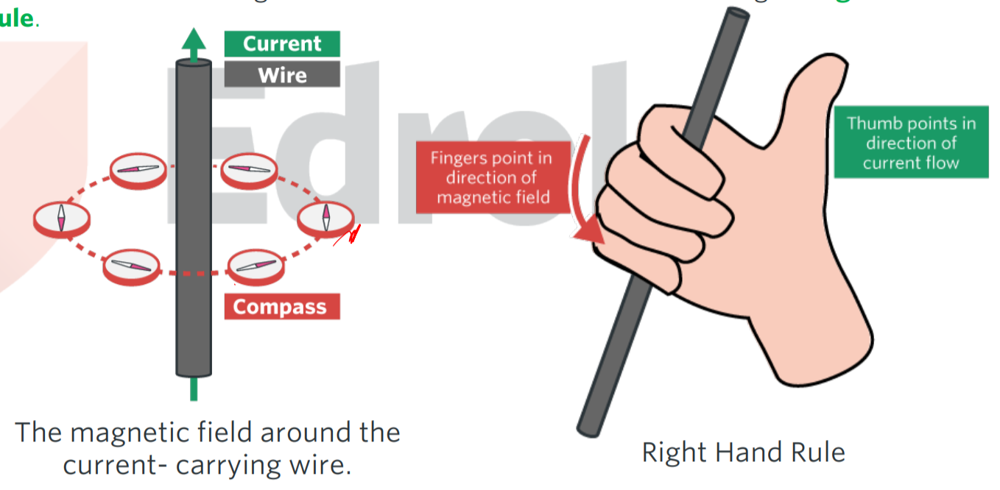
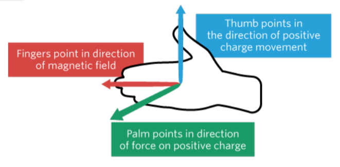
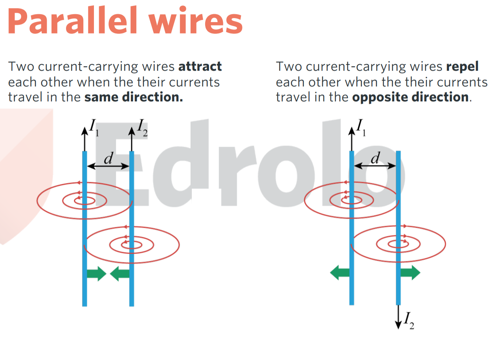

# How do things move without contact?

**Inverse square law** states that if the distance is increased by a factor of $a$, then the Force is decreased by a factor of $a^2$.

$$F\propto{\frac{1}{r^2}}$$

## Gravitational

| name                           | symbol | units                 |
| ------------------------------ | ------ | --------------------- |
| Mass                           | $M,m$  | $(kg)$                |
| Gravitational field strength   | $g$    | $(Nkg^{-1})(ms^{-2})$ |
| Gravitational constant         | $G$    | $(m^3kg^{-1}s^{-2})$  |
| Gravitational force            | $F_g$  | $(N)$                 |
| Gravitational potential energy | $E_g$  | $(J)$                 |

$$G=6.67\times{}10^{-11}$$

$$g=\frac{GM}{r^2}$$

$$F_g=mg=\frac{GMm}{r^2}$$

$$E_g=mg\Delta{h}$$

**Kepler's law** states that the period of orbit square divided by the radius of orbit cubed is a constant.

$$\frac{T^2}{r^3}=\frac{4\pi^2}{GM}$$

## Electrical

| name                      | symbol | units                |
| ------------------------- | ------ | -------------------- |
| Charge                    | $Q,q$  | $(C)$                |
| Electrical field strength | $E$    | $(NC^{-1})(Vm^{-1})$ |
| Coulomb's constant        | $k$    | $(Nm^2C^{-2})$       |
| Electric force            | $F_e$  | $(N)$                |
| Voltage                   | $V$    | $(V)$                |
| Distance                  | $d$    | $(m)$                |
| Work done                 | $W$    | $(J)$                |

$$Q_{proton}=1.6\times{}10^{-19}$$

$$m_{electron}=9.1\times{}10^{-31}$$

$$k=\frac{1}{4\pi{}\varepsilon_0}=8.987\times{}10^9$$

$$E=\frac{kQ}{r^2}$$

$$F_e=qE=\frac{kQq}{r^2}$$

$$W=fd=qV$$

## Magnetic

| name                    | symbol | units       |
| ----------------------- | ------ | ----------- |
| Charge                  | $q$    | $(C)$       |
| Velocity                | $v$    | $(ms^{-1})$ |
| Magnetic field strength | $B$    | $(T)$       |
| Number of loops         | $n$    |             |
| Current                 | $I$    | $(A)$       |
| Length                  | $l$    | $(m)$       |

### Lorentz force $(N)$

$$F_m=qvB$$

$$F_m=nilB$$

